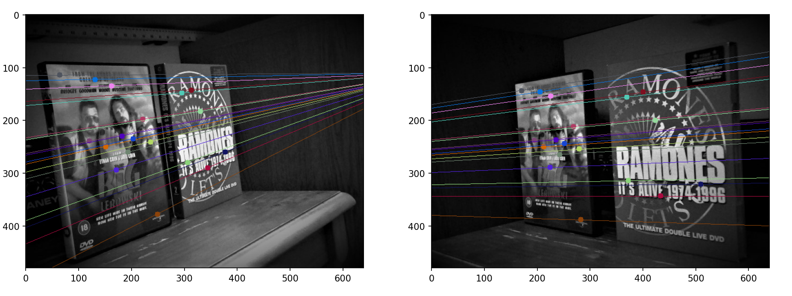

# Epipolar Geometry Visualization

A simple Python script that attempts to visualize epipolar geometry using either SIFT or ORB feature detection methods. 

## How It Works

The script loads two images (left and right views) and detects keypoints using either SIFT or ORB. Then, it computes the epipolar lines and displays them. 

### Features

- **SIFT/ORB Feature Matching**: You can switch between these two methods to see which one works best for your images.
- **Epilines Visualization**: Automatically draws the epipolar lines on the images so you can see where the matching points lie.

### Usage

 Make sure your images are in the `demoImages` folder and named `image_l.jpg` and `image_r.jpg`. If you want to see the epipolar lines, use the `drawStereoEpilines` function.

```python
# Example usage
eg = EpipolarGeometry(showImages=False)
eg.drawStereoEpilines(method='ORB')  # or use 'SIFT'
```

### Images ouput



## Installation

You'll need Python and a few libraries like NumPy, OpenCV, and Matplotlib. Just install them using pip:

```bash
pip install numpy opencv-python matplotlib
```
